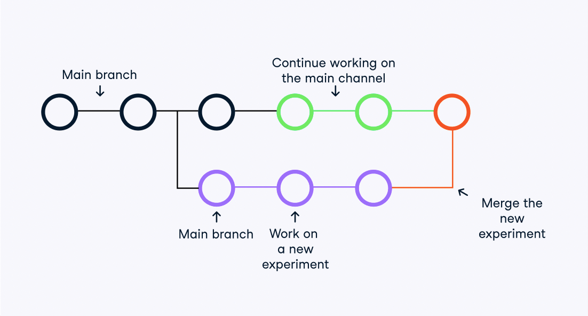

## What is Version Control?

Version control systems are tools that manage changes made to files and directories in a project. They allow you to keep track of what you did when, undo any changes you decide you don't want, and collaborate at scale with others. This cheat sheet focuses on one of the most popular ones, Git.

## Key Definitions

### Basic Definitions
- **Local Repository (Local Repo)**: A directory on your local machine containing the code and files for the project.
- **Remote Repository**: An online version of the local repository hosted on platforms like GitHub, GitLab, and Bitbucket.
- **Cloning**: The process of creating a copy or clone of a repository in a new directory on your local machine.
- **Commit**: A snapshot of the project at a specific point in time, capturing changes made to files.
- **Branch**: A separate copy of the project used for working in an isolated environment, allowing changes to be made without affecting the main project.
- **Git Merge**: The process of combining changes from one branch into another.

### More Advanced Definitions
- **.gitignore File**: A file that specifies patterns of files or directories that Git should ignore, typically used for excluding large data folders, private information, and local files from version control.
- **Staging Area**: A cache that holds changes you intend to include in the next commit.
- **Git Stash**: Another type of cache used for temporarily storing changes that you may want to apply later.
- **Commit ID or Hash**: A unique identifier assigned to each commit, used for referencing specific points in the project's history.
- **HEAD**: A symbolic reference to the latest commit in the current branch. The syntax HEAD~n is used to refer to older commits, with ~n indicating the number of commits to move back in history (e.g., HEAD~2 refers to the second-to-last commit).

## Installing Git

To check if Git is installed on your system, you can open a terminal or command prompt and type the following command:

```
git --version
```

After running this command, if Git is installed, you'll see the version number of Git displayed in the terminal. If Git is not installed, you'll likely receive an error message indicating that the command is not recognized.

## Setting Up Git

### Setting User Credentials in Git

To ensure proper attribution of code changes in a team environment, Git allows you to set user credentials such as name and email. Here's how you can configure your basic information:

#### Configure Your Email

```bash
$ git config user.email [your.email@domain.com]
```

#### Configure Your Name

```bash
$ git config user.name [your-name]
```

### Important Tags for Configuration Scope

Git provides tags to determine the scope of the configurations you're setting up. Here are the tags and their usage:

#### Local Directory, Single Project (Default Tag)

```bash
$ git config --local user.email “my_email@example.com”
```

#### All Git Projects Under the Current User

```bash
$ git config --global user.email “my_email@example.com”
```

#### For All Users on the Current Machine

```bash
$ git config --system user.email “my_email@example.com”
```

### Other Useful Configuration Commands

#### List All Key-Value Configurations

```bash
$ git config --list
```

#### Get the Value of a Single Key

```bash
$ git config --get <key>
```

### Setting Aliases for Common Commands

Git allows you to set aliases for commonly used commands for quicker access. Here's how you can create aliases:

#### Create an Alias for "git commit" (e.g., `gc`)

```bash
$ git config --global alias.gc commit
```

Now, you can use `gc` instead of `git commit`:

```bash
$ gc -m “New commit”
```

#### Create an Alias for "git add" (e.g., `ga`)

```bash
$ git config --global alias.ga add
```

### What is a Branch?

Branches in Git are special copies of the codebase that allow you to work on different parts of a project or new features in an isolated environment. Changes made in a branch won't affect the main development channel (usually referred to as the "main branch" or "master branch"). Branches facilitate parallel development and experimentation without impacting the stability of the main project.



## Git Basics

### What is a Repository?

A repository, often referred to as a repo, is a location that stores code and the necessary files required for it to function correctly. Repositories can be either local or remote. A local repository typically resides within a directory on your machine, while a remote repository is hosted on servers like GitHub.

### Creating Local Repositories

- **Clone a Repository from Remote Hosts**:

```bash
$ git clone <remote_repo_url>
```

- **Initialize Git Tracking Inside the Current Directory**:

```bash
$ git init
```

- **Create a Git-Tracked Repository Inside a New Directory**:

```bash
$ git init [dir_name]
```

- **Clone Only a Specific Branch**:

```bash
$ git clone --branch <branch_name> <repo_url>
```

- **Cloning into a Specified Directory**:

```bash
$ git clone <repo_url> <dir_name>
```

### A Note on Cloning

There are two primary methods of cloning a repository: HTTPS syntax and SSH syntax. While SSH cloning is generally considered more secure because it requires an SSH key for authentication, HTTPS cloning is simpler and the recommended option by GitHub.

- **HTTPS Cloning**:

```bash
$ git clone https://github.com/your_username/repo_name.git
```

- **SSH Cloning**:

```bash
$ git clone git@github.com:user_name/repo_name.git
```

### Managing Remote Repositories

- **List Remote Repositories**:

```bash
$ git remote
```

- **Create a New Connection to a Remote Repository**:

```bash
$ git remote add <remote> <url_to_remote>
```

- **Remove a Connection to a Remote Repository**:

```bash
$ git remote rm <remote>
```

- **Rename a Remote Connection**:

```bash
$ git remote rename <old_name> <new_name>
```

Understanding these basic Git commands will help you effectively manage your repositories and collaborate with others seamlessly.

## Working with Files

### Adding and Removing Files

- **Add a File or Directory to Git for Tracking**:

```bash
$ git add <filename_or_dir>
```

- **Add All Untracked and Tracked Files Inside the Current Directory to Git**:

```bash
$ git add .
```

- **Remove a File from the Working Directory or Staging Area**:

```bash
$ git rm <filename_or_dir>
```

### Saving and Working with Changes

- **See Changes in the Local Repository**:

```bash
$ git status
```

- **Saving a Snapshot of the Staged Changes with a Custom Message**:

```bash
$ git commit -m “[Commit message]”
```

- **Staging Changes in All Tracked Files and Committing with a Message**:

```bash
$ git add -am “[Commit message]”
```

- **Editing the Message of the Latest Commit**:

```bash
$ git commit --amend -m “[New commit message]”
```

- **Saving Staged and Unstaged Changes to Stash for Later Use**:

```bash
$ git stash
```

- **Stashing Everything (Including Ignored Files)**:

```bash
$ git stash --all
```

- **Reapply Previously Stashed Changes and Empty the Stash**:

```bash
$ git stash pop
```

- **Dropping Changes in the Stash**:

```bash
$ git stash drop
```

- **Show Uncommitted Changes Since the Last Commit**:

```bash
$ git diff
```

- **Show the Differences Between Two Commits**:

```bash
$ git diff <id_1> <id_2>
```

### Branches

- **List All Branches**:

```bash
$ git branch
```

- **Create a New Local Branch Named `new_branch` Without Checking Out That Branch**:

```bash
$ git branch <new_branch>
```

- **Switch Into an Existing Branch Named `<branch>`**:

```bash
$ git checkout <branch>
```

- **Create a New Local Branch and Switch Into It**:

```bash
$ git checkout -b <new_branch>
```

- **Safe Delete a Local Branch (Prevents Deleting Unmerged Changes)**:

```bash
$ git branch -d <branch>
```

- **Force Delete a Local Branch (Whether Merged or Unmerged)**:

```bash
$ git branch -D <branch>
```

- **Push a Copy of Local Branch Named `branch` to the Remote Repository**:

```bash
$ git push <remote_repo> branch
```

- **Delete a Remote Branch Named `branch`**:

```bash
$ git push <remote_repo> --delete branch
```

- **Merging a Branch Into the Main Branch**:

```bash
$ git checkout main
$ git merge <other_branch>
```

- **Compare the Differences Between Two Branches**:

```bash
$ git diff <branch_1> <branch_2>
```

### Pulling Changes

- **Download All Commits and Branches from the `<remote>` Without Applying Them on the Local Repo**:

```bash
$ git fetch <remote>
```

- **Only Download the Specified `<branch>` from the `<remote>`**:

```bash
$ git fetch <remote> <branch>
```

- **Merge the Fetched Changes if Accepted**:

```bash
$ git merge <remote>/<branch>
```

- **A More Aggressive Version of Fetch Which Calls Fetch and Merge Simultaneously**:

```bash
$ git pull <remote>
```

### Logging and Reviewing Work

- **List All Commits with Their Author, Commit ID, Date, and Message**:

```bash
$ git log
```

- **List One Commit Per Line**:

```bash
$ git log --oneline
```

- **Log All Commits with Diff Information**:

```bash
$ git log --stat
```

- **Log Commits After Some Date**:

```bash
$ git log --oneline --after=”YYYY-MM-DD”
```

- **Log Commits Before Some Date**:

```bash
$ git log --oneline --before=”last year”
```

### Reversing Changes

- **Checking Out (Switching To) Older Commits**:

```bash
$ git checkout HEAD~3
```

- **Undo the Latest Commit but Leave the Working Directory Unchanged**:

```bash
$ git reset HEAD~1
```

- **Discard All Changes of the Latest Commit (No Easy Recovery)**:

```bash
$ git reset --hard HEAD~1
```

- **Undo a Single Given Commit, Without Modifying Commits That Come After It (A Safe Reset)**:

```bash
$ git revert [commit_id]
```

Understanding these Git commands will help you manage your codebase effectively and collaborate with your team smoothly.